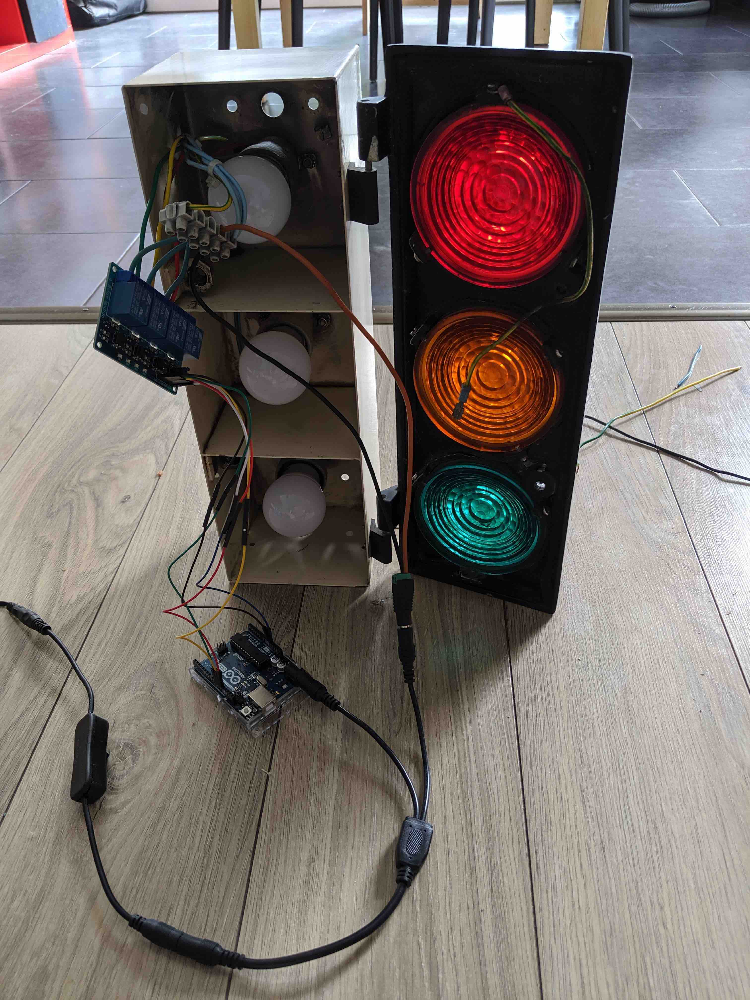

# Home Traffic Lights using an Arduino

Code to animate a traffic lights at home.

I've bought some remainings of a traffic lights in a flea market. With an Arduino,
I've restored it so one can select a light pattern with a pattern.

Note: the power source is 12V, even the LED light bulbs are 12V. I am not an
electronic expert (rather a software engineer), so no way I control a 220V power
source.

